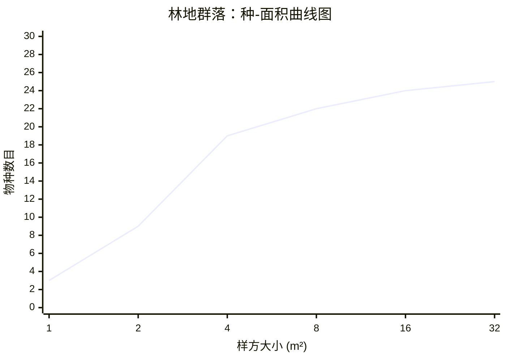

# 林地群落：种-面积曲线图

## 数据说明

| 样方大小 (m²) | 物种数目 |
|---|---|
| 1 | 3 |
| 2 | 9 |
| 4 | 19 |
| 8 | 22 |
| 16 | 24 |
| 32 | 25 |

## 特点分析

- **曲线趋势**：随着样方面积增大，物种数目逐步增加
- **增长模式**：呈现典型的对数增长特征（S型曲线）
- **快速增长期**：从 1 m² 到 8 m²，物种数目增长迅速（3→22）
- **缓慢增长期**：从 8 m² 到 32 m²，物种数目增长缓慢（22→25）
- **饱和趋势**：在 32 m² 时，物种数目基本饱和（25个物种）
- **物种富集度**：林地群落的物种丰富度较高，体现了林地生态系统的复杂性
