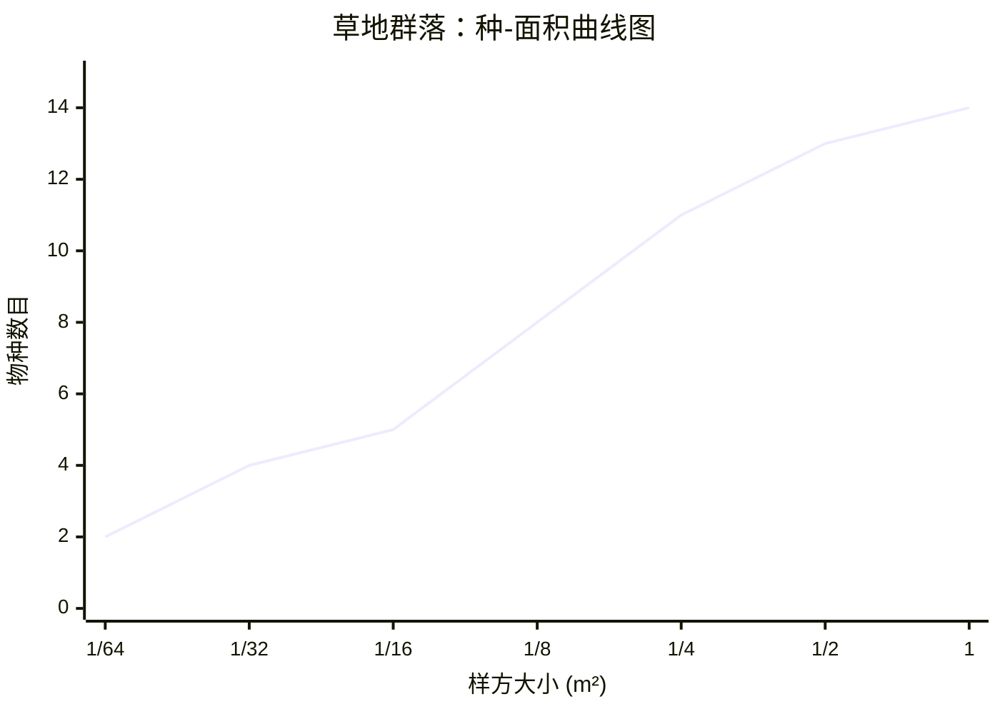

# 草地群落：种-面积曲线图

## 数据说明

| 样方大小 (m²) | 物种数目 |
|---|---|
| 1/64 | 2 |
| 1/32 | 4 |
| 1/16 | 5 |
| 1/8 | 8 |
| 1/4 | 11 |
| 1/2 | 13 |
| 1 | 14 |

## 特点分析

- **曲线趋势**：随着样方面积增大，物种数目逐步增加
- **增长模式**：呈现对数增长特征
- **饱和点**：在样方大小为 1 m² 时，物种数目达到 14（基本饱和）
- **物种累积**：从 1/64 m² 的 2 个物种增加到 1 m² 的 14 个物种
