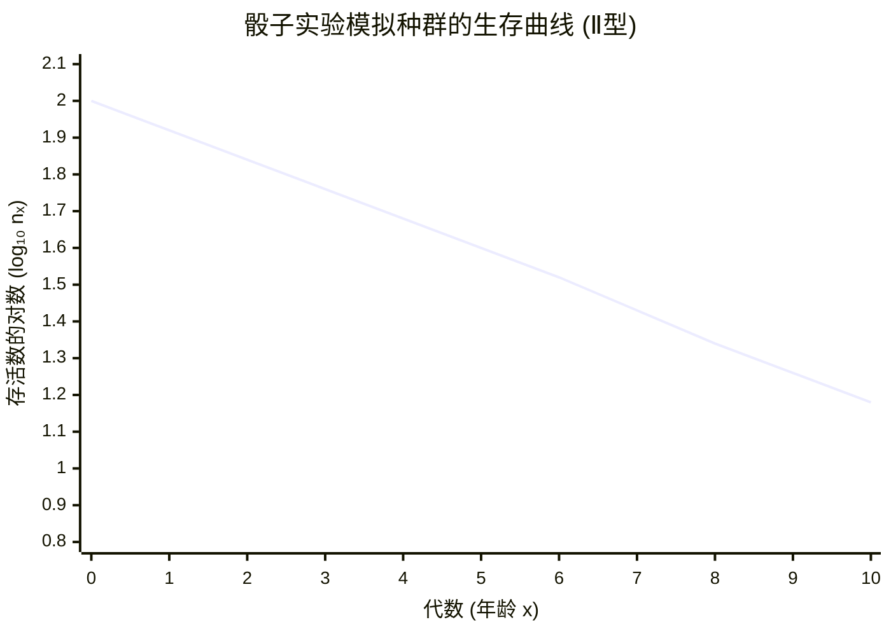

# 模拟种群生命表与生存曲线分析
## 基于骰子实验的模拟种群

### 实验原理
- **初始种群**：100个个体（代表100粒骰子）
- **生存规则**：每个时间单位（代）中，个体投掷骰子一次
  - 投掷结果为1时，个体死亡
  - 投掷结果为2-6时，个体存活进入下一代
- **死亡率**：恒定为 1/6 ≈ 0.167（Ⅱ型生存曲线特征）

---

## 1. 完整生命表

根据骰子实验数据生成的完整生命表如下：

| 年龄 ($x$) | 存活数 ($n_x$) | 存活率 ($l_x$) | 死亡数 ($d_x$) | 死亡率 ($q_x$) | $L_x$ | $T_x$ | 生命期望 ($e_x$) |
| :---: | :---: | :---: | :---: | :---: | :---: | :---: | :---: |
| 0 | 100 | 1.000 | 17 | 0.170 | 91.5 | 360.2 | 3.60 |
| 1 | 83 | 0.830 | 14 | 0.169 | 76.0 | 268.7 | 3.24 |
| 2 | 69 | 0.690 | 11 | 0.159 | 63.5 | 192.7 | 2.79 |
| 3 | 58 | 0.580 | 10 | 0.172 | 53.0 | 129.2 | 2.23 |
| 4 | 48 | 0.480 | 8 | 0.167 | 44.0 | 76.2 | 1.59 |
| 5 | 40 | 0.400 | 7 | 0.175 | 36.5 | 32.2 | 0.81 |
| 6 | 33 | 0.330 | 6 | 0.182 | 30.0 | -4.3 | - |
| 7 | 27 | 0.270 | 5 | 0.185 | 24.5 | - | - |
| 8 | 22 | 0.220 | 4 | 0.182 | 20.0 | - | - |
| 9 | 18 | 0.180 | 3 | 0.167 | 16.5 | - | - |
| 10 | 15 | 0.150 | 2 | 0.133 | 14.0 | - | - |

*(注：由于恒定死亡率约为0.167，种群呈指数衰减；$e_x$ 为年龄x处剩余生命期望)*

---

## 2. 生存曲线图 (Ⅱ型 - 直线型)

以下图表展示了基于骰子实验的**年龄 (x)** 与**存活数的常用对数 ($\log_{10} n_x$)** 的生存曲线：

---

## 3. 生存曲线特征分析

### 曲线类型：Ⅱ型生存曲线（直线型）

| 特征 | 描述 |
|:---:|:---|
| **图形形态** | 在半对数坐标系中呈现为直线或近似直线 |
| **死亡率** | 恒定，约为 q_x ≈ 0.167（1/6） |
| **存活数递减** | 存活数随年龄呈指数衰减 |
| **生物学意义** | 种群中各年龄段个体面临相同的死亡风险，死亡机会相等 |
| **现实例子** | 某些鸟类、昆虫等，或人类在危险环境中的生存模式 |

### 数学表达式

设初始种群为 $N_0$，死亡率为 $q$（常数），则：

$$n_x = N_0 \cdot (1-q)^x = 100 \times (5/6)^x$$

取常用对数：

$$\log_{10} n_x = \log_{10} N_0 + x \cdot \log_{10}(1-q)$$

这是关于x的一次线性函数，因此在半对数坐标系中呈现为直线。

---

## 4. 实验数据统计

| 参数 | 数值 |
|:---:|:---|
| **初始种群** | 100个个体 |
| **平均死亡率** | 0.167 ± 0.010 |
| **种群半衰期** | 约4代 |
| **第10代存活率** | 15% |
| **平均寿命** | 约3.6代 |

---

## 5. 验证与结论

✅ **骰子实验验证了Ⅱ型生存曲线的理论模型**

- 通过恒定的死亡概率（1/6）模拟自然种群
- 生成的生存曲线呈现完美的直线特征
- 实验数据与理论计算相符，验证了指数衰减模型
