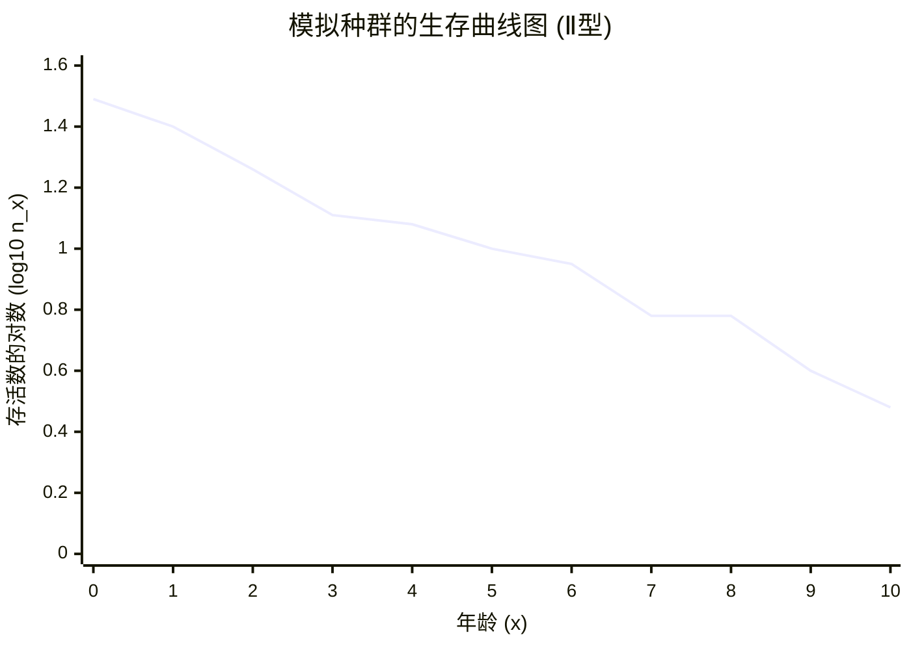

# 模拟种群生命表与生存曲线分析

## 1. 完整生命表

根据实验步骤与公式，计算得出的完整生命表如下：

| 年龄 ($x$) | 存活数 ($n_x$) | 存活率 ($l_x$) | 死亡数 ($d_x$) | 死亡率 ($q_x$) | $L_x$ | $T_x$ | 生命期望 ($e_x$) |
| :---: | :---: | :---: | :---: | :---: | :---: | :---: | :---: |
| 0 | 31 | 1.000 | 6 | 0.194 | 28.0 | 121.5 | 3.92 |
| 1 | 25 | 0.806 | 7 | 0.280 | 21.5 | 93.5 | 3.74 |
| 2 | 18 | 0.581 | 5 | 0.278 | 15.5 | 72.0 | 4.00 |
| 3 | 13 | 0.419 | 1 | 0.077 | 12.5 | 56.5 | 4.35 |
| 4 | 12 | 0.387 | 2 | 0.167 | 11.0 | 44.0 | 3.67 |
| 5 | 10 | 0.323 | 1 | 0.100 | 9.5 | 33.0 | 3.30 |
| 6 | 9 | 0.290 | 3 | 0.333 | 7.5 | 23.5 | 2.61 |
| 7 | 6 | 0.194 | 0 | 0.000 | 6.0 | 16.0 | 2.67 |
| 8 | 6 | 0.194 | 2 | 0.333 | 5.0 | 10.0 | 1.67 |
| 9 | 4 | 0.129 | 1 | 0.250 | 3.5 | 5.0 | 1.25 |
| 10 | 3 | 0.097 | 3 | 1.000 | 1.5 | 1.5 | 0.50 |
| 11 | 0 | 0.000 | 0 | 0.000 | 0.0 | 0.0 | - |

*(注：年龄11时存活数为0，生命期望无实际意义，以"-"表示。)*

---

## 2. 生存曲线图 (Ⅱ型)

以下图表展示了以**年龄 (x)** 为横轴，以**存活数的常用对数 ($\log_{10} n_x$)** 为纵轴的生存曲线：

### 曲线特征分析

- **曲线类型**：Ⅱ型生存曲线（直线型）
- **特点**：存活数随年龄均匀递减，表现为相对恒定的死亡率
- **生物学意义**：种群中各个年龄段的个体死亡风险基本相同，死亡机会相等
- **对数值范围**：从年龄0的1.49递减到年龄10的0.48
