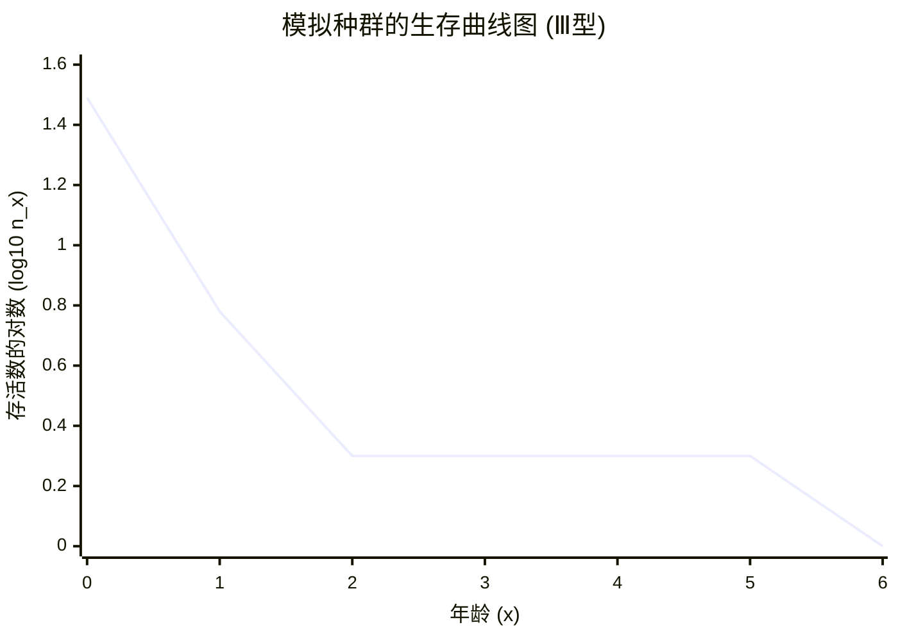

# 模拟种群生命表与生存曲线分析（新数据组）

## 1. 完整生命表计算结果

根据公式：
*   $l_x = n_x / n_0$ 
*   $d_x = n_x - n_{x+1}$
*   $q_x = d_x / n_x$
*   $L_x = (n_x + n_{x+1}) / 2$
*   $T_x = \sum L_x$
*   $e_x = T_x / n_x$

计算得出的完整生命表如下：

| 年龄 ($x$) | 存活数 ($n_x$) | 存活率 ($l_x$) | 死亡数 ($d_x$) | 死亡率 ($q_x$) | $L_x$ | $T_x$ | 生命期望 ($e_x$) |
| :---: | :---: | :---: | :---: | :---: | :---: | :---: | :---: |
| 0 | 31 | 1.000 | 25 | 0.806 | 18.5 | 30.5 | 0.98 |
| 1 | 6 | 0.194 | 4 | 0.667 | 4.0 | 12.0 | 2.00 |
| 2 | 2 | 0.065 | 0 | 0.000 | 2.0 | 8.0 | 4.00 |
| 3 | 2 | 0.065 | 0 | 0.000 | 2.0 | 6.0 | 3.00 |
| 4 | 2 | 0.065 | 0 | 0.000 | 2.0 | 4.0 | 2.00 |
| 5 | 2 | 0.065 | 1 | 0.500 | 1.5 | 2.0 | 1.00 |
| 6 | 1 | 0.032 | 1 | 1.000 | 0.5 | 0.5 | 0.50 |
| 7 | 0 | 0.000 | 0 | 0.000 | 0.0 | 0.0 | - |

*(注：比率数据保留3位小数，其余各项保留1-2位小数。年龄7时全部死亡，生命期望无意义，以"-"表示。)*

---

## 2. 生存曲线图 (由 GitHub Mermaid 自动渲染)

提取存活个体存在的时间段（年龄 0-6），并对存活数取 10 的对数：
*   $x=0, \log_{10}(31) \approx 1.49$
*   $x=1, \log_{10}(6) \approx 0.78$
*   $x=2, \log_{10}(2) \approx 0.30$
*   $x=3, \log_{10}(2) \approx 0.30$
*   $x=4, \log_{10}(2) \approx 0.30$
*   $x=5, \log_{10}(2) \approx 0.30$
*   $x=6, \log_{10}(1) = 0.00$

绘制的生存曲线如下：

---

## 3. 生存曲线特征分析

### 曲线类型：Type III (Ⅲ型)

该生存曲线具有以下特点：

- **高早期死亡率**：年龄0时死亡率达80.6%（31个中有25个个体死亡）
- **陡峭初期下降**：从年龄0到年龄1，存活数从31急剧下降到6
- **平台期**：年龄2-5期间保持2个存活个体
- **完全灭绝**：年龄6之后全部死亡

### 生态学意义

Type III型生存曲线常见于以下生物：
- 鱼类和水生幼虫
- 昆虫的浮游幼虫
- 大量产卵但存活率低的植物种子

此种群显示出典型的高幼体死亡率特征，这是许多水生和无脊椎动物的生存策略。
